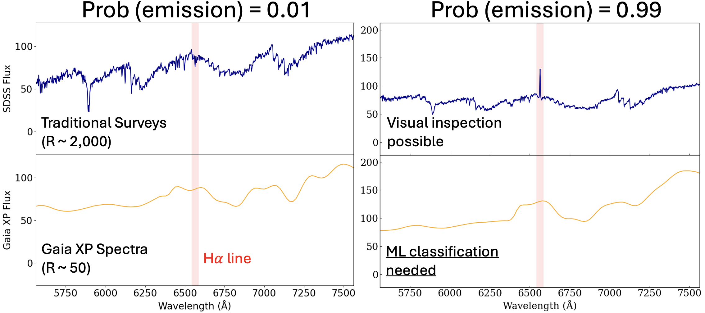
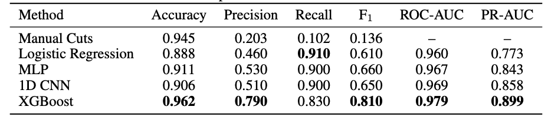

# Enchancing Ultra Low Resolution Astronomical Data with ML

The European Space Agency's Gaia mission has done something remarkable: it has collected spectra for over a billion stars. The catch? These aren't the rich, wavelength-resolved spectra that stellar spectroscopists dream about. Gaia's BP/RP photometers compress each star's light into just 110 numbers — 55 coefficients for the blue photometer, 55 for the red — representing projections onto a set of Hermite basis functions. It's a dimensionality reduction baked into the hardware.

This is the data we're working with. The scientific goal is identifying H-alpha emission-line stars: objects with detectable emission at 656.3 nm, a signature of chromospheric activity, accretion, or mass transfer. These include classical Be stars, T Tauri stars, Herbig Ae/Be objects, and various interacting binaries. They're astrophysically interesting, they're relatively rare, and finding them in 110-dimensional Hermite-coefficient space is genuinely non-trivial.

### Quick Aside: Astronomical Spectroscopy

## Building the Training Set

Before any model could be trained, we needed labeled examples — stars we *knew* were or weren't H-alpha emitters. This turned out to be the most painstaking part of the project.

The strategy was to cross-match Gaia sources against SDSS spectroscopy. SDSS gives us real, medium-resolution optical spectra with enough wavelength coverage and resolution to definitively call an H-alpha emission line. The pipeline went roughly like this: run a SQL query against the SDSS archive to pull stellar spectra in the relevant magnitude and color range, download them in bulk using plate-mjd-fiber identifiers, apply a continuum-normalized peak detection around 6562.8 Å, and flag anything with a significant emission feature.

In practice, this was messier than it sounds. SDSS column naming is inconsistent across data releases (it's `fiberID`, not `fiberid`, and that cost time). Redshift corrections had to be applied before line detection. Many spectra had quality issues — bad sky subtraction, chip gaps, saturation — that produced spurious detections either way. Each automated flag needed visual spot-checking. A catalog that looked like a table of ones and zeros represented hours of careful verification per few hundred sources.

The positive class also had a prior: we incorporated a LAMOST-verified H-alpha emitter catalog as a backbone, giving the labeled set a more reliable foundation than SDSS alone could provide.

## A Tour of Failed and Successful Models

With labeled data in hand, we ran a systematic model comparison on the 110-dimensional XP coefficient vectors.

**Logistic regression** worked surprisingly well — better than everything else at first. This was an early signal that the classification boundary, while high-dimensional, might be relatively linear in coefficient space, and that data quality mattered more than model complexity.

**XGBoost** eventually pulled ahead: ROC-AUC 0.979, PR-AUC 0.899. Gradient boosting handles the tabular structure of the coefficients naturally, is robust to the class imbalance problem (genuine emitters are rare), and doesn't need thousands of examples to generalize. LightGBM performed comparably and served as a useful cross-check.

**Neural networks** struggled. A 1D CNN and an FT-Transformer both underperformed the tree-based methods by a significant margin, with the transformer sitting around ROC-AUC 0.824. The culprit was data scale — transformers want hundreds of thousands of labeled examples, and we had a few thousand. We also saw severe overfitting: training and validation loss curves diverged early and dramatically, a clear sign the networks were memorizing rather than learning. This is a familiar frustration in astronomical ML: the data regime where deep learning becomes truly competitive is often exactly the regime that's hardest to reach with expensive spectroscopic follow-up.

## The Denoising Autoencoder

The solution is a two-phase denoising autoencoder (DAE). Phase 1 is entirely unsupervised: we corrupt the input by masking either all BP or all RP coefficients, then train the network to reconstruct the masked half from the visible half. This corruption strategy is physically motivated — H-alpha at 656.3 nm falls right in the BP/RP overlap region, so cross-masking forces the encoder to learn spectral structure near the line of interest. And crucially, Phase 1 runs on the full unlabeled Gaia catalog — millions of stars, no SDSS follow-up required.

The latent space that emerges reflects genuine stellar physics. Principal components track temperature, luminosity, and spectral type in ways consistent with our prior knowledge.

Phase 2 adds a classification head and fine-tunes on our SDSS-derived labels. This is where things get dangerous: fine-tuning can destroy the rich Phase 1 representations. We saw this directly — PC1 variance jumped from 53% in Phase 1 to 91% after naive fine-tuning, a signature of representation collapse where the encoder stops encoding stellar diversity and starts encoding only the emission/non-emission axis. The fix is to freeze the encoder during Phase 2 and let only the classification head update, preserving the learned stellar manifold while adapting the readout.

## Why This Matters Beyond the Catalog

There's a longer-term interpretability angle here that we find genuinely exciting. Stellar spectra are unusual as an ML testbed: the ground truth is independently verifiable. If a sparse autoencoder trained on the DAE's latent space recovers a feature direction corresponding to H-alpha emission strength, we can confirm it by running GaiaXPy spectral reconstruction and measuring the line directly. The physics provides an external oracle that most neural network interpretability work lacks entirely.

The night sky, it turns out, makes a surprisingly good controlled environment for understanding what neural networks actually learn.

*Data from Gaia DR3 and SDSS DR17. Code available on request.*

— Tony
