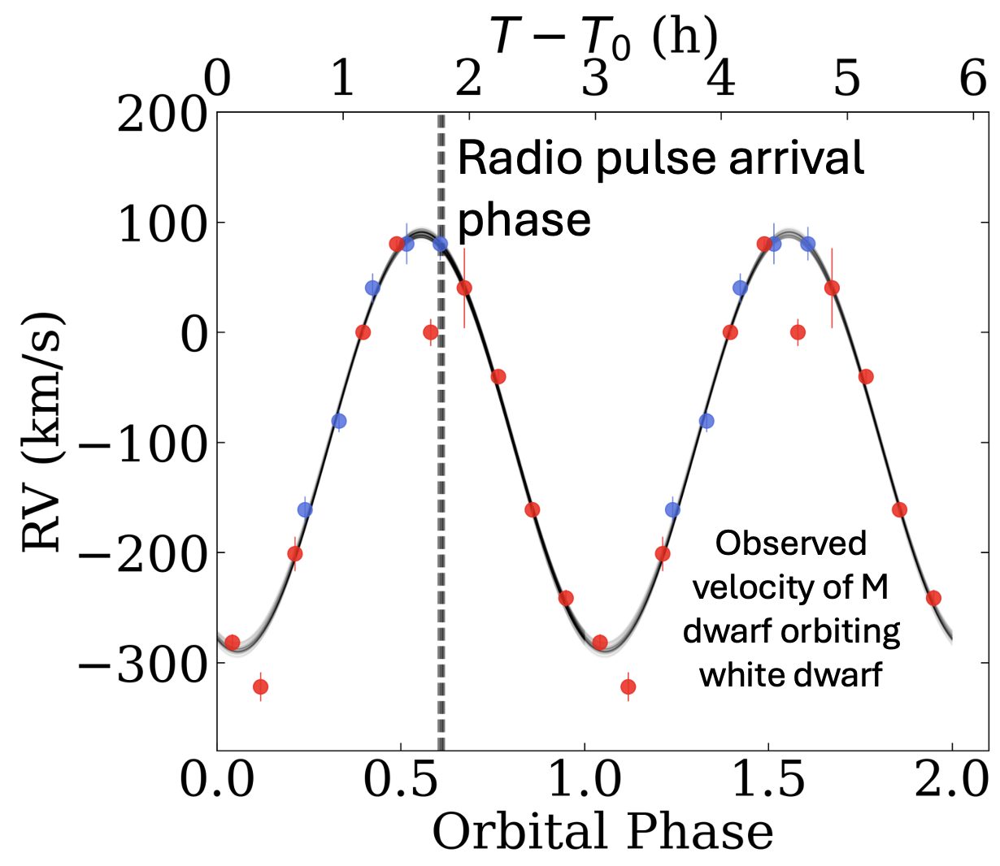

## [About Me](https://acrodrig98.github.io/)
## [My Research](https://acrodrig98.github.io/research)
## [Code and Data](https://acrodrig98.github.io/code)
## [Recorded Talks and Press](https://acrodrig98.github.io/talks)

### Overview

My astrophysics work primarily involves the discovery of new stars (typically binary systems) that teach us something new about what phenomena are possible in space.

I have primarily used multiwavelength crossmatched between X-rays from the [SRG/eROSITA mission](https://www.mpe.mpg.de/eROSITA) and optical data from the [Zwicky Transient Facility](https://www.ztf.caltech.edu) and [Gaia](https://www.esa.int/Science_Exploration/Space_Science/Gaia_overview). I also use data from other [X-ray](https://chandra.harvard.edu/), [optical](https://www.keckobservatory.org/), and [radio](https://www.vla.nrao.edu/) telescopes. I am broadly interested in applying statistical techniques to extract scientific results out of large astronomical datasets, and have shown that [a simple tool, the "X-ray Main Sequence",](https://ui.adsabs.harvard.edu/abs/2024PASP..136e4201R/abstract) can efficiently reveal the true [demographics of accreting white dwarfs](https://ui.adsabs.harvard.edu/abs/2024arXiv240816053R/abstract) in the solar neighborhood.

### A New Class of Radio-pulsing Sources: Long Period Radio Transients

Long period radio transients (LPTs) have been the first new class of radio pulsators in decades. Until now, pulsars and millisecond pulsars have occupied the sub-period regime, while LPTs exhibit radio pulse periods on the order of minutes to hours. 

[My work](https://ui.adsabs.harvard.edu/abs/2025A%26A...695L...8R/abstract) demonstrated, via optical spectroscopy, that one newly-discovered LPT was actually a binary system consisting of an M dwarf orbiting a white dwarf star.

### Accreting White Dwarfs (Cataclysmic Variables)

### Ultracompact White Dwarfs and Gravitational Waves (AM CVn Binaries)

### Stellar-Mass Black Holes 

### Gravitational Microlensing

### FU Ori Objects: The Most Powerful Young Stars
